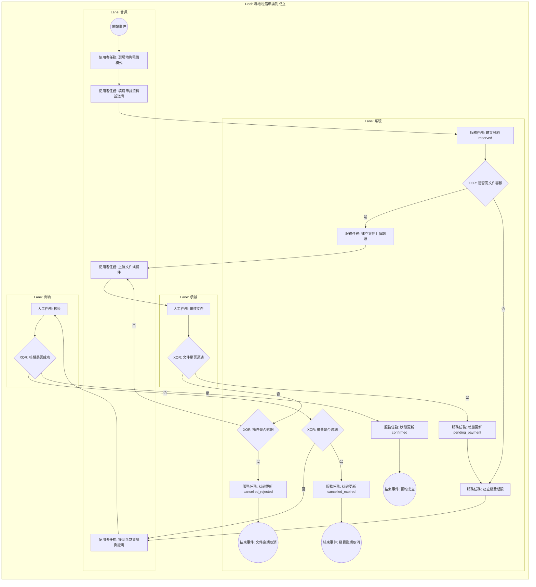

# 場地租借申請到成立 BPMN 規格

## 1. 流程目標

定義會員從選場地到預約成立的完整流程，涵蓋文件審核、繳費審核與逾期取消分支。

## 2. 起訖條件

- 開始事件：會員在前台送出預約申請。
- 結束事件：
  - 預約成立（confirmed）
  - 逾期取消（cancelled_expired）
  - 文件退件未補（cancelled_rejected）

## 2.1 流程圖（泳道）

## 3. 泳道角色

1. 會員
2. 系統
3. 承辦
4. 出納

## 4. 主流程任務

1. 會員：選擇場地與租借模式，填寫申請資料並送出。
2. 系統：建立預約（reserved），產生文件或繳費期限。
3. 承辦：若需文件，執行文件審核。
4. 系統：文件通過後轉待繳費（pending_payment）。
5. 會員：提交匯款資訊與證明。
6. 出納：核帳並確認款項。
7. 系統：狀態更新為預約成立（confirmed）。

## 5. 關鍵閘道

1. 是否需要文件審核（requireDocuments）
2. 文件是否通過
3. 是否於期限內補件
4. 是否於期限內完成繳費
5. 核帳是否成功

## 6. 例外與補償

1. 文件退件：回到會員補件任務。
2. 補件逾期：系統自動取消（cancelled_rejected）。
3. 繳費逾期：系統自動取消（cancelled_expired）。
4. 核帳失敗：保持待確認或退回會員補件。

## 7. 系統對應

- 路由與頁面：
  - src/view/portal/Venue/VenueBooking.vue
  - src/view/portal/Venue/VenueConfirm.vue
  - src/view/portal/member/MyBookings.vue
  - src/view/portal/member/BookingDetail.vue
- 狀態模型：
  - src/stores/bookings.ts

## 8. BPMN 繪圖重點

1. 使用排他閘道處理文件需求與審核結果。
2. 以中介計時事件表達補件/繳費截止。
3. 取消分支需落到明確結束事件，避免懸空流程。
