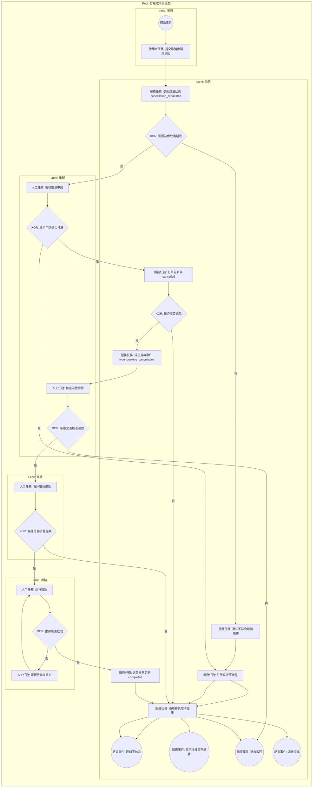

# 訂單取消與退款 BPMN 規格

## 1. 流程目標

定義已成立訂單之取消申請、審核與退款銜接流程。

## 2. 起訖條件

- 開始事件：會員提出取消申請。
- 結束事件：
  - 取消核准且退款完成
  - 取消核准且不退款結案
  - 取消不核准（維持原訂單）

## 2.1 流程圖（泳道）

## 3. 泳道角色

1. 會員
2. 系統
3. 承辦
4. 會計
5. 出納

## 4. 主流程任務

1. 會員：提交取消原因。
2. 系統：更新為 cancellation_requested。
3. 承辦：審核取消申請。
4. 系統：若核准則訂單更新為 cancelled，並建立退款案件（booking_cancellation）。
5. 承辦：核定退款金額並送會計。
6. 會計：核定後送出納。
7. 出納：完成撥款。
8. 系統：退款狀態更新 completed。

## 5. 關鍵閘道

1. 是否符合取消期限
2. 取消申請是否核准
3. 是否需要退款
4. 承辦是否核准退款
5. 會計是否核准退款

## 6. 例外與補償

1. 取消不核准：通知會員，訂單回原狀態。
2. 退款駁回：退款狀態為 rejected，流程結案。
3. 撥款失敗：回到出納處理任務並保留待辦。

## 7. 系統對應

- 前台：
  - src/view/portal/member/BookingDetail.vue
- 後台：
  - src/view/admin/refunds.vue
  - src/view/admin/bookings/components/RefundProcessingBlock.vue
- 資料模型：
  - src/stores/bookings.ts
  - src/stores/refunds.ts

## 8. BPMN 繪圖重點

1. 將「取消審核」與「退款簽核」拆成兩段任務鏈。
2. 退款簽核建議以子流程表示（承辦→會計→出納）。
3. 明確標示 rejected 結束事件。
