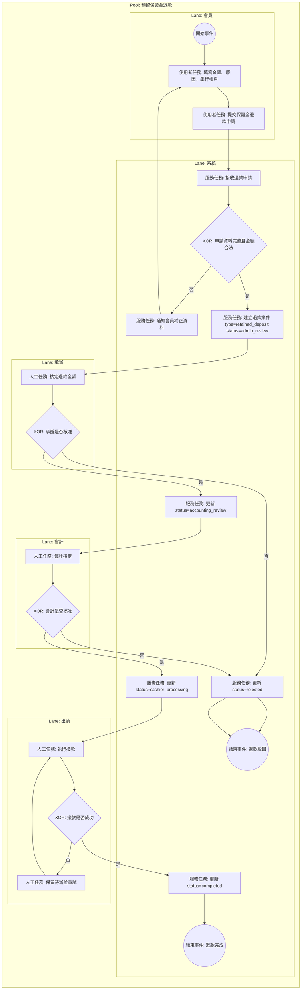

# 預留保證金退款 BPMN 規格

## 1. 流程目標

定義會員從帳戶頁申請退還留存保證金，到後台多角色簽核與撥款完成之流程。

## 2. 起訖條件

- 開始事件：會員於帳戶頁提交保證金退款申請。
- 結束事件：
  - 退款完成（completed）
  - 退款駁回（rejected）

## 2.1 流程圖（泳道）

## 3. 泳道角色

1. 會員
2. 系統
3. 承辦
4. 會計
5. 出納

## 4. 主流程任務

1. 會員：填寫申請金額、退款原因與銀行帳戶。
2. 系統：建立退款案件（retained_deposit / admin_review）。
3. 承辦：核定退款金額。
4. 系統：轉 accounting_review。
5. 會計：核定並送出納。
6. 系統：轉 cashier_processing。
7. 出納：執行撥款。
8. 系統：更新 completed，會員可於退款頁查看。

## 5. 關鍵閘道

1. 申請金額是否超過留存保證金
2. 退款資料是否完整
3. 承辦是否核准
4. 會計是否核准

## 6. 例外與補償

1. 資料不完整：退回會員補正。
2. 承辦或會計駁回：狀態 rejected 並通知會員。
3. 撥款失敗：保留 cashier_processing 待重試。

## 7. 系統對應

- 前台：
  - src/view/portal/member/MyProfile.vue
  - src/view/portal/member/MyRefunds.vue
- 後台：
  - src/view/admin/refunds.vue
- 資料模型：
  - src/stores/refunds.ts

## 8. BPMN 繪圖重點

1. 此流程與訂單取消退款分開建模，不要合併。
2. 用訊息事件表示會員收到進度通知。
3. 金額核定任務建議加資料物件（申請金額、核定金額）。
