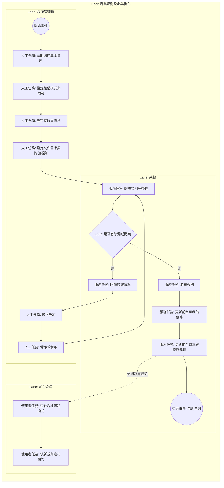

# 場館規則設定與發布 BPMN 規格

## 1. 流程目標

定義後台如何維護場館租借規則並發布，使前台預約行為與費率計算一致生效。

## 2. 起訖條件

- 開始事件：管理員新增或調整場館規則。
- 結束事件：規則發布並於前台生效。

## 2.1 流程圖（泳道）

## 3. 泳道角色

1. 場館管理員
2. 系統
3. 前台會員（被動受影響）

## 4. 主流程任務

1. 管理員：編輯場館基本資料。
2. 管理員：設定租借模式、時段、價格、文件需求與限制。
3. 系統：驗證規則完整性與衝突。
4. 管理員：儲存並發布。
5. 系統：更新前台可租借規則與驗證條件。
6. 會員：於前台看到最新可租模式與費率。

## 5. 關鍵閘道

1. 規則是否完整
2. 時段或價格是否衝突
3. 發布是否成功

## 6. 例外與補償

1. 驗證失敗：提示缺漏並回編輯步驟。
2. 發布失敗：保留草稿與錯誤記錄。

## 7. 系統對應

- 後台頁面：
  - src/view/admin/venues/index.vue
  - src/view/admin/venues/edit/basic.vue
  - src/view/admin/venues/edit/rentalRules.vue
  - src/view/admin/venues/edit/rental.vue
- 前台頁面：
  - src/view/portal/Venue/VenueList.vue
  - src/view/portal/Venue/VenueDetail.vue
  - src/view/portal/Venue/VenueBooking.vue
- 規則結構：
  - docs/databaseTableSchema.md

## 8. BPMN 繪圖重點

1. 建議用資料物件標記規則集（模式、費率、時段）。
2. 發布前驗證可建模為服務任務 + 排他閘道。
3. 前台生效可用訊息流表示規則下發。
