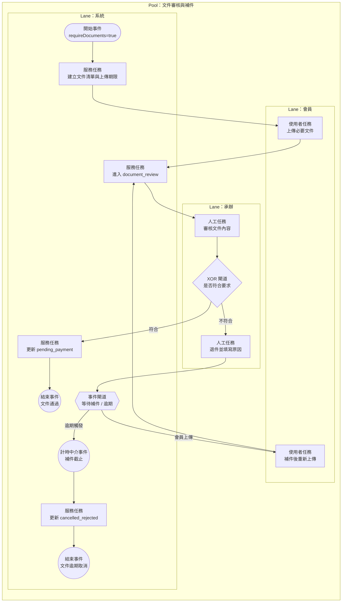

# 文件審核與補件 BPMN 規格

## 1. 流程目標

定義需要文件的預約案件，如何進行上傳、退件、補件與通過，並銜接到繳費階段。

## 2. 起訖條件

- 開始事件：預約建立後且 requireDocuments = true。
- 結束事件：
  - 文件審核通過（進入 pending_payment）
  - 文件逾期取消（cancelled_rejected）

## 2.1 流程圖（泳道）

## 3. 泳道角色

1. 會員
2. 系統
3. 承辦

## 4. 主流程任務

1. 系統：建立文件清單與上傳期限。
2. 會員：上傳必要文件。
3. 承辦：審核文件。
4. 系統：通過則進入待繳費。

## 5. 關鍵閘道

1. 文件是否齊全
2. 文件是否符合要求
3. 是否在補件期限內

## 6. 例外與補償

1. 文件不符：標記 documents_rejected 並附退件原因。
2. 會員補件：回到審核任務。
3. 補件逾期：系統自動 cancelled_rejected。

## 7. 系統對應

- 前台：
  - src/view/portal/member/BookingDetail.vue
- 後台：
  - src/view/admin/bookings/components/DocumentReviewBlock.vue
- 狀態模型：
  - src/stores/bookings.ts

## 8. BPMN 繪圖重點

1. 文件審核建議畫成循環子流程（審核 -> 退件 -> 補件）。
2. 補件期限務必用計時中介事件標示。
3. 退件原因可作為資料物件掛於退件任務。
