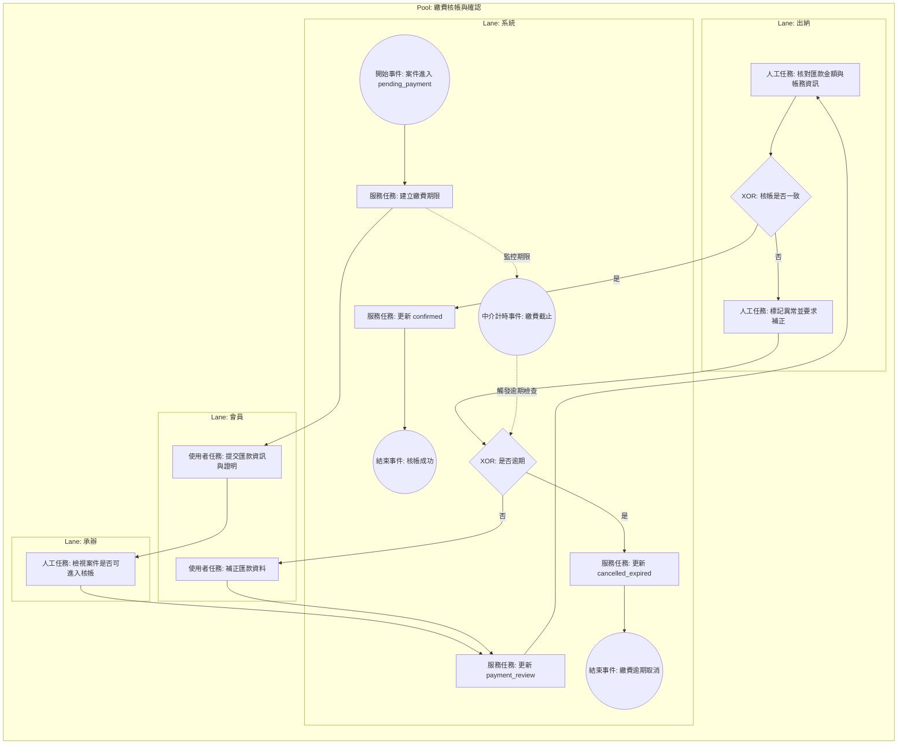

# 繳費核帳與確認 BPMN 規格

## 1. 流程目標

定義會員提交匯款資訊後，承辦/出納進行核帳並完成預約成立的流程。

## 2. 起訖條件

- 開始事件：案件進入待繳費（pending_payment）。
- 結束事件：
  - 核帳成功（confirmed）
  - 逾期取消（cancelled_expired）

## 2.1 流程圖（泳道）

## 3. 泳道角色

1. 會員
2. 系統
3. 承辦
4. 出納

## 4. 主流程任務

1. 系統：建立繳費期限。
2. 會員：提交匯款資訊與繳費證明。
3. 出納：核對金額與帳務資訊。
4. 系統：核帳通過後更新 confirmed。

## 5. 關鍵閘道

1. 是否在繳費期限內
2. 匯款資料是否完整
3. 核帳是否一致

## 6. 例外與補償

1. 資料不完整：退回會員補件。
2. 核帳不一致：標記異常並要求補正。
3. 繳費逾期：系統自動 cancelled_expired。

## 7. 系統對應

- 前台：
  - src/view/portal/member/BookingDetail.vue
- 後台：
  - src/view/admin/bookings/components/PaymentReviewBlock.vue
- 狀態模型：
  - src/stores/bookings.ts

## 8. BPMN 繪圖重點

1. 用中介計時事件表達繳費截止。
2. 用排他閘道區分核帳一致/不一致。
3. 核帳成功後以訊息流通知會員案件成立。
