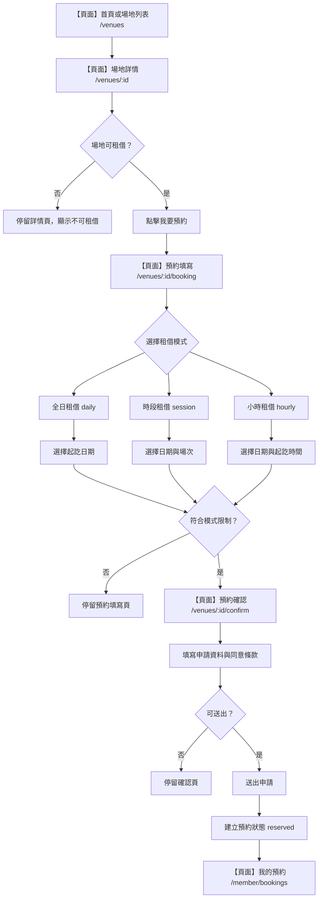

# 租借申請主流程（P0）

```mermaid
flowchart TD
  A[【頁面】首頁或場地列表 /venues] --> B[【頁面】場地詳情 /venues/:id]
  B --> C{場地可租借？}
  C -- 否 --> C1[停留詳情頁，顯示不可租借]
  C -- 是 --> D[點擊我要預約]
  D --> E[【頁面】預約填寫 /venues/:id/booking]

  E --> F{選擇租借模式}
  F --> F1[全日租借 daily]
  F --> F2[時段租借 session]
  F --> F3[小時租借 hourly]

  F1 --> G1[選擇起訖日期]
  F2 --> G2[選擇日期與場次]
  F3 --> G3[選擇日期與起訖時間]

  G1 --> H{符合模式限制？}
  G2 --> H
  G3 --> H
  H -- 否 --> H1[停留預約填寫頁]
  H -- 是 --> I[【頁面】預約確認 /venues/:id/confirm]

  I --> J[填寫申請資料與同意條款]
  J --> K{可送出？}
  K -- 否 --> K1[停留確認頁]
  K -- 是 --> L[送出申請]
  L --> M[建立預約狀態 reserved]
  M --> N[【頁面】我的預約 /member/bookings]
```
