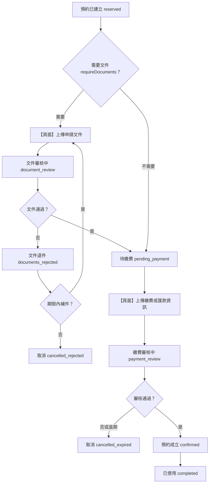

# 文件與繳費審核流程（P0）

```mermaid
flowchart TD
  A[預約已建立 reserved] --> B{需要文件 requireDocuments？}

  B -- 需要 --> C[【頁面】上傳申請文件]
  C --> D[文件審核中 document_review]
  D --> E{文件通過？}
  E -- 否 --> F[文件退件 documents_rejected]
  F --> G{期限內補件？}
  G -- 是 --> C
  G -- 否 --> H[取消 cancelled_rejected]
  E -- 是 --> I[待繳費 pending_payment]

  B -- 不需要 --> I

  I --> J[【頁面】上傳繳費或匯款資訊]
  J --> K[繳費審核中 payment_review]
  K --> L{審核通過？}
  L -- 否或逾期 --> M[取消 cancelled_expired]
  L -- 是 --> N[預約成立 confirmed]
  N --> O[已使用 completed]
```
