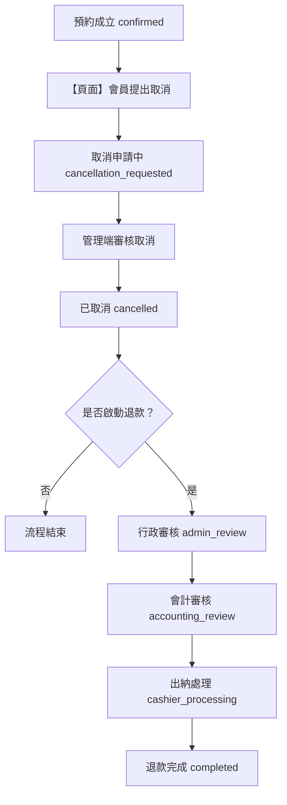

# 取消與退款流程（P0）

```mermaid
flowchart TD
  A[預約成立 confirmed] --> B[【頁面】會員提出取消]
  B --> C[取消申請中 cancellation_requested]
  C --> D[管理端審核取消]
  D --> E[已取消 cancelled]
  E --> F{是否啟動退款？}
  F -- 否 --> Z[流程結束]
  F -- 是 --> R1[行政審核 admin_review]
  R1 --> R2[會計審核 accounting_review]
  R2 --> R3[出納處理 cashier_processing]
  R3 --> R4[退款完成 completed]
```
