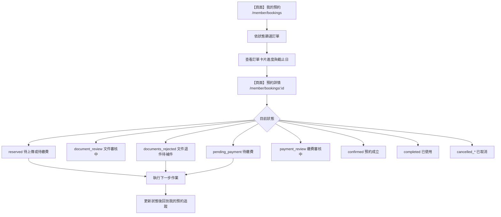

# 會員中心追蹤流程（P1）

```mermaid
flowchart TD
  A[【頁面】我的預約 /member/bookings] --> B[依狀態篩選訂單]
  B --> C[查看訂單卡片進度與截止日]
  C --> D[【頁面】預約詳情 /member/bookings/:id]
  D --> E{目前狀態}

  E --> E1[reserved 待上傳或待繳費]
  E --> E2[document_review 文件審核中]
  E --> E3[documents_rejected 文件退件待補件]
  E --> E4[pending_payment 待繳費]
  E --> E5[payment_review 繳費審核中]
  E --> E6[confirmed 預約成立]
  E --> E7[completed 已使用]
  E --> E8[cancelled_* 已取消]

  E1 --> F[執行下一步作業]
  E3 --> F
  E4 --> F
  F --> G[更新狀態後回到我的預約追蹤]
```
