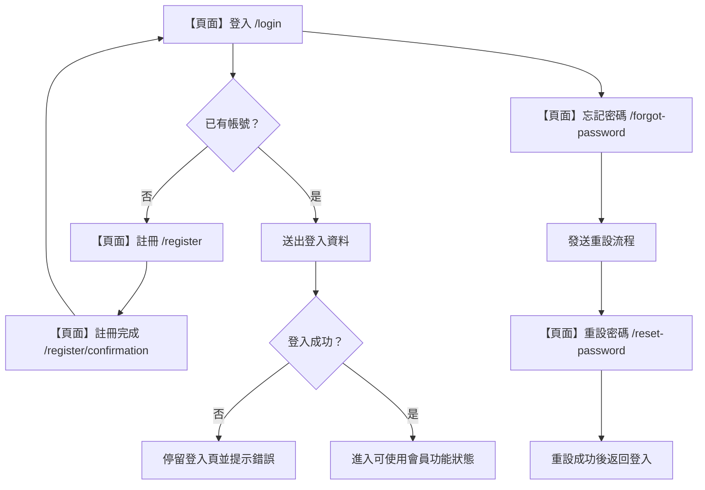

# 身分驗證流程（P1）

```mermaid
flowchart TD
  A[【頁面】登入 /login] --> B{已有帳號？}
  B -- 否 --> C[【頁面】註冊 /register]
  C --> D[【頁面】註冊完成 /register/confirmation]
  D --> A

  B -- 是 --> E[送出登入資料]
  E --> F{登入成功？}
  F -- 否 --> F1[停留登入頁並提示錯誤]
  F -- 是 --> G[進入可使用會員功能狀態]

  A --> H[【頁面】忘記密碼 /forgot-password]
  H --> I[發送重設流程]
  I --> J[【頁面】重設密碼 /reset-password]
  J --> K[重設成功後返回登入]
```
