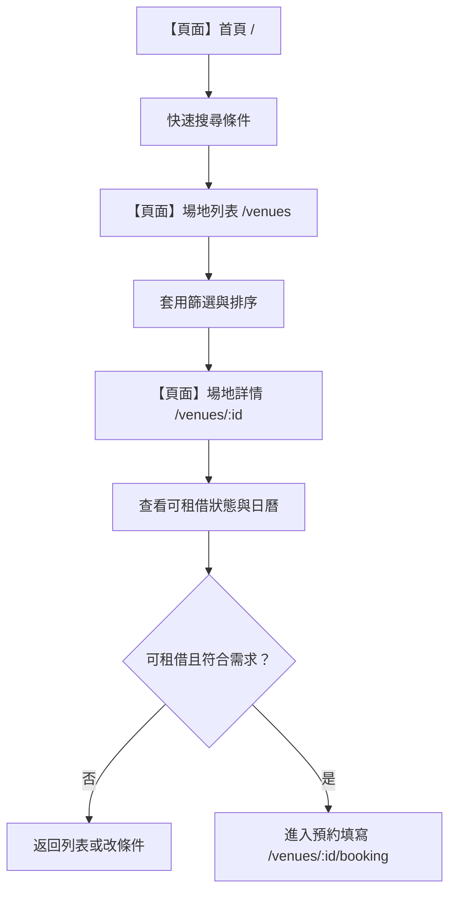

# 場地探索到預約入口流程（P1）

```mermaid
flowchart TD
  A[【頁面】首頁 /] --> B[快速搜尋條件]
  B --> C[【頁面】場地列表 /venues]
  C --> D[套用篩選與排序]
  D --> E[【頁面】場地詳情 /venues/:id]
  E --> F[查看可租借狀態與日曆]
  F --> G{可租借且符合需求？}
  G -- 否 --> H[返回列表或改條件]
  G -- 是 --> I[進入預約填寫 /venues/:id/booking]
```
