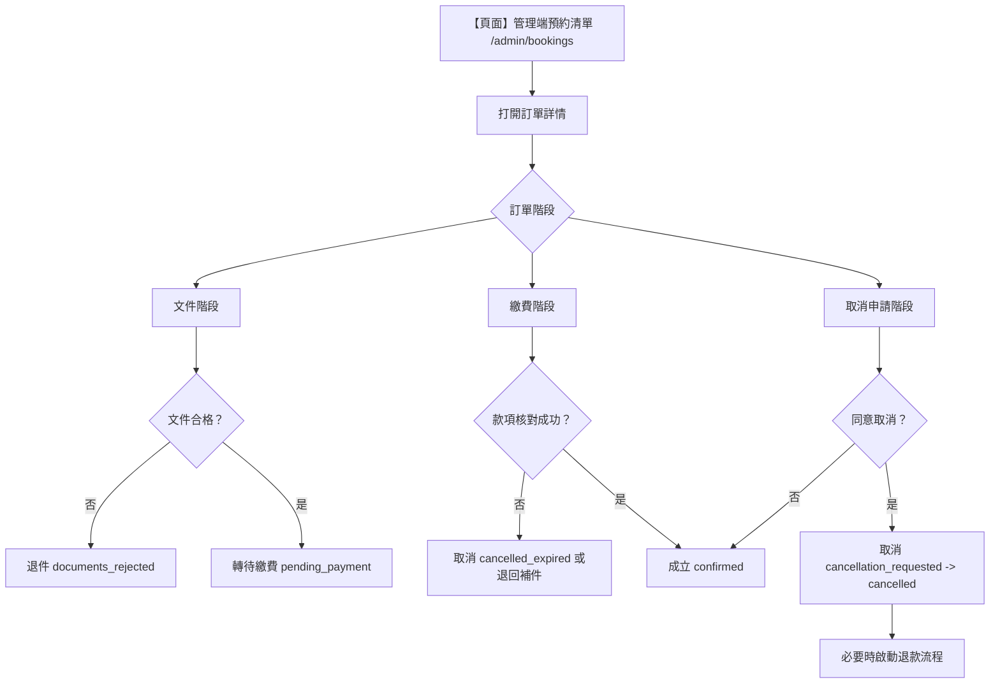

# 管理端審核作業流程（P2）

```mermaid
flowchart TD
  A[【頁面】管理端預約清單 /admin/bookings] --> B[打開訂單詳情]
  B --> C{訂單階段}

  C --> C1[文件階段]
  C1 --> D{文件合格？}
  D -- 否 --> E[退件 documents_rejected]
  D -- 是 --> F[轉待繳費 pending_payment]

  C --> C2[繳費階段]
  C2 --> G{款項核對成功？}
  G -- 否 --> H[取消 cancelled_expired 或退回補件]
  G -- 是 --> I[成立 confirmed]

  C --> C3[取消申請階段]
  C3 --> J{同意取消？}
  J -- 否 --> I
  J -- 是 --> K[取消 cancellation_requested -> cancelled]
  K --> L[必要時啟動退款流程]
```
