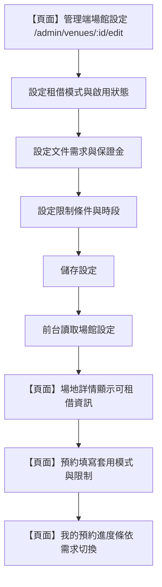

# 場館設定影響前台規則流程（P2）

```mermaid
flowchart TD
  A[【頁面】管理端場館設定 /admin/venues/:id/edit] --> B[設定租借模式與啟用狀態]
  B --> C[設定文件需求與保證金]
  C --> D[設定限制條件與時段]
  D --> E[儲存設定]

  E --> F[前台讀取場館設定]
  F --> G[【頁面】場地詳情顯示可租借資訊]
  G --> H[【頁面】預約填寫套用模式與限制]
  H --> I[【頁面】我的預約進度條依需求切換]
```
